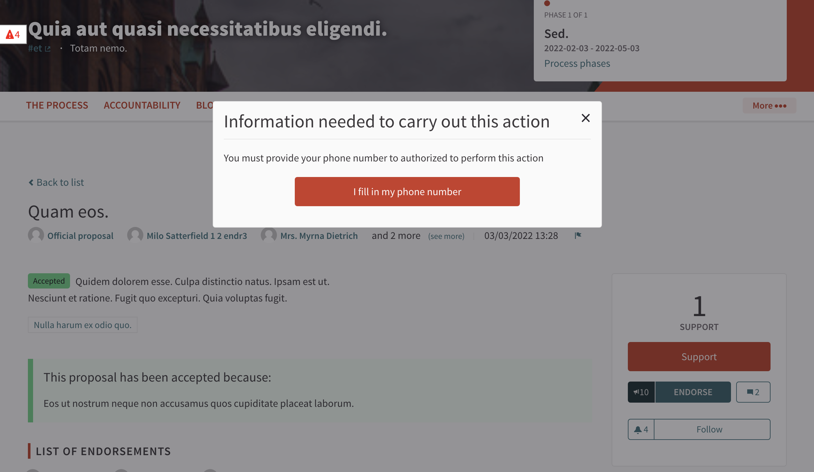
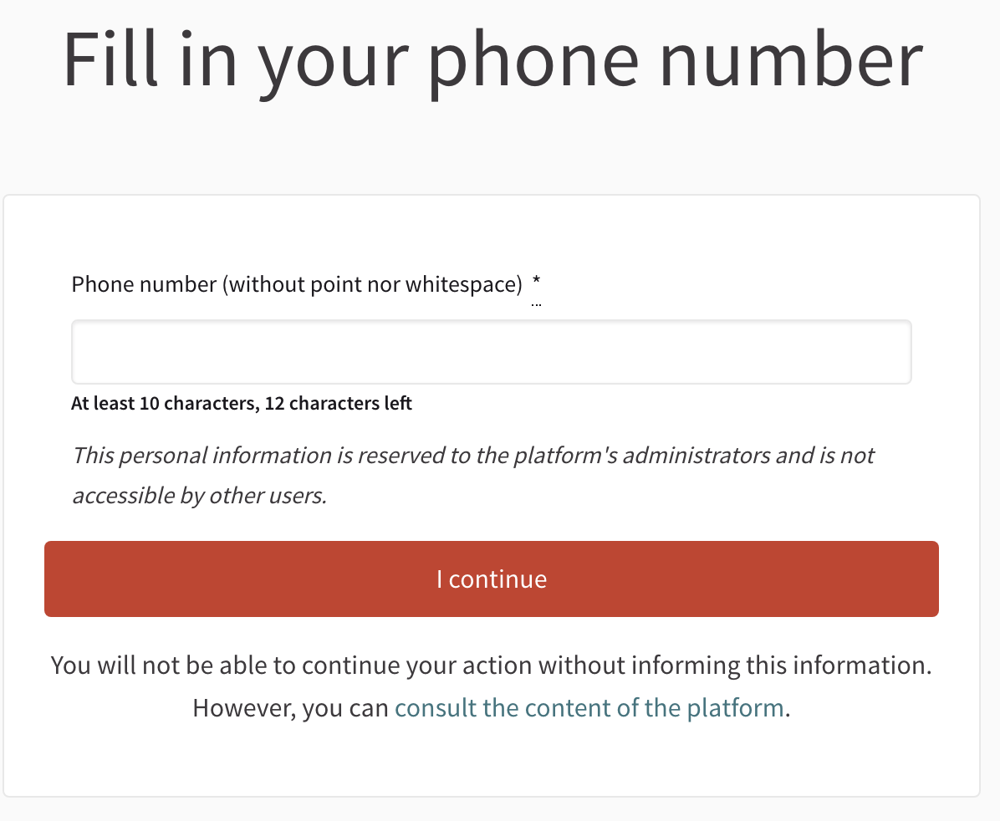

# Module Phone Authorization Handler

Ask a phone number through a Decidim authorization handler before any protected action.




## Requirements
* Decidim `>= v0.25.2`

## Usage

You can setup easily the phone authorization handler from Decidim system and backoffice, let's see : 

1. First, log in system side at `https://example.com/system`
2. Edit your organization
3. Check the "Phone Authorization Handler checkbox"
4. Save your organization's configuration

Great the phone authorization handler should now be available !

**Activate phone authorization handler on proposal component**

1. Log in as administrator
2. Navigate to participatory process in backoffice
3. Navigate to Components show view
4. Manage permissions for the proposals
5. Enable phone authorization handler

Congratulations, users will have to refer their phone number before being authorized to perform actions. 

## Installation

Add this line to your application's Gemfile:

```ruby
gem 'decidim-phone_authorization_handler', git: 'github.com/OpenSourcePolitics/decidim-module_phone_authorization_handler.git', branch: 'master'
```

And then execute:

```bash
bundle
```

## Please note the customizations

This module overrides decidim's exporters by adding a private export to prevent phone number from being exported by not adminstrators users.

At the moment, this module is fully compatible with Decidim instance, however conflicts can happen with other modules. 

## Contributing

See [Decidim](https://github.com/decidim/decidim) for contributing directly to Decidim.
See [module's contributing guide](./docs/CONTRIBUTING.md) for contributing on the module.

Thanks !

## License

This engine is distributed under the GNU AFFERO GENERAL PUBLIC LICENSE.
